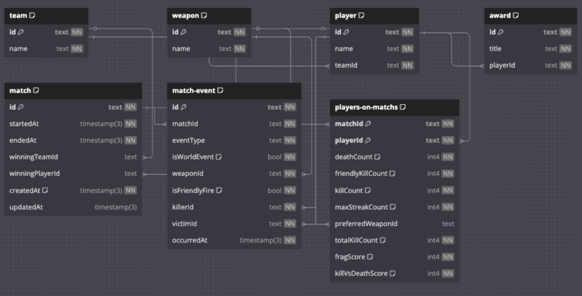

# Arquitetura (componentes)

Componentes:

1) **Postgresql:** Usado para armazenar dados de domínio e transacionais;
2) **Redis**: Garante performance com cache e lock distribuído evitando duplicatas;
3) **SEQ**: Monitoramento envolvendo logs, eventos e traces;
4) **OTEL (open telemetry)**: Usado para enviar dados do container de aplicação ao SEQ;
5) **AWS S3**: Usado para armazenar os dados dos logs das oartidas usando Presigned URL e Bucket Notifications integrado com o SQS;
6) **AWS SQS**: Usado para enfileirar os arquivos e processamento das partidas antes de criar as métricas de partidas e rankings globais.

# Etapas de processamento

Como é feito o processamento dos logs?

1) Ingestão dos dados e efileiramento

2) Processamento assíncrono

3) Persistência dos dados relacionais

4) Exposição dos dados

5) Atualização das estatísticas globais (consultas pesadas)

### Log Processing Steps

# Logs de decisões de arquitetura

O que é um ADR? [Clique aqui para ler](./ADR/ADR%20-%20What%20is.md)

## Tabela de ADR's

| Code | Topic | Link |
|------|-------|------|
|ADR_OO1 | Banco de dados |[🔗 abrir](./ADR/ADR_OO1-Banco%20de%20dados.md)|
|ADR_OO2 | Materialized View |[🔗 abrir](./ADR/ADR_OO2-Materialized%20View.md)|
|ADR_OO3 | Redis |[🔗 abrir](./ADR/ADR_OO3-Redis.md)|

# Diagrama Entidade Relacionamento

# Navegação

🔙 [Voltar: Getting Started](./1-Getting%20Started.md)

🔜 [Avançar: Running locally](./3-Running%20locally.md)